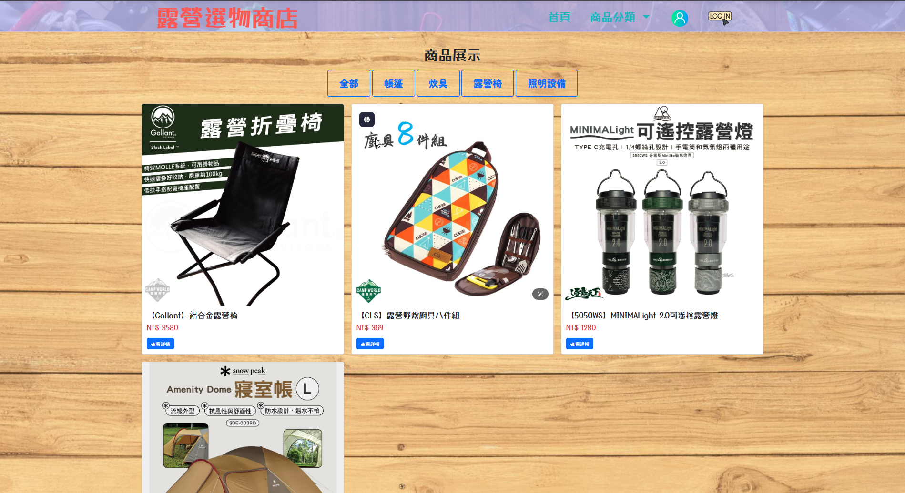

# 露營選物商店 🌲

## 專案介紹 📝

**露營選物商店** 是一款專為露營愛好者設計的線上選物平台，旨在提供高品質的露營裝備與戶外用品，讓用戶輕鬆選購並享受自然生活。本專案目前專注於前端展示，整合直觀的商品瀏覽與購物車功能，未來計畫擴展至完整的電子商務管理系統，涵蓋會員管理、訂單處理與後台數據分析。

- **開發目標** 🚀: 打造一個簡單易用的露營選物平台，提升用戶購物體驗並推廣戶外生活方式。
- **應用場景** 🌐: 適用於露營裝備銷售、戶外活動推廣或其他小型電商需求。
- **開發進度** ⏳: 自啟動以來持續迭代，截至 2025 年 4 月 9 日仍處於活躍開發階段。

---

## 頁面展示 🖼️

以下是專案的主要頁面展示（目前以單頁式設計為主）：

### 前台頁面 🌍
1. **商店首頁** 🏠  
     
   *展示精選露營商品與導航，提供直觀的購物入口*

2. **商品展示區** 🛒  
     
   *顯示商品詳情、價格功能*

3. **商品詳情**   
     
   *用戶可以查看商品詳細資訊*
   
4. **會員註冊** 
     
   *可供消費者註冊帳號*
      
5. **會員登入** 
     
   *可供註冊者登入帳號*

6. **商品上架** 
     
   *管理者可以上架商品資料*
   
7. **商品列表** 
     
   *管理者可以更新或刪除商品資料*     
---

## 專案技術 💻

本專案採用現代化的前端技術，確保高效能與良好的用戶體驗，後端功能尚在規劃中。

### 前端技術 🎨
- **HTML5**: 結構化頁面內容。
- **CSS3 / Bootstrap** 🌈: 響應式設計與戶外風格配色。
- **JavaScript**:  
  - **jQuery**: 處理表單與動態互動。  
- **SweetAlert2** 🔔: 美觀的通知與提示框（若適用）。

### 後端技術 🛠️（規劃中）
- **PHP**: 未來用於處理訂單與商品邏輯。
- **MySQL** 🗄️: 儲存商品與訂單數據，支援 `utf8mb4` 編碼。
- **檔案上傳** 📤: 支援商品圖片上傳，限制格式與大小。

### 其他 ⚙️
- **環境需求**: 目前僅需靜態伺服器，未來需 PHP 7.4+ 與 MySQL 5.7+。
- **部署方式**: 可部署於支援靜態檔案的伺服器（如 GitHub Pages），未來支援 PHP 伺服器（如 Apache）。

---

## 功能簡介 ✨

### 商品管理 🛍️
- **商品瀏覽**: 用戶可查看露營裝備，按類別（如帳篷、炊具）瀏覽。
- **詳細資訊**: 提供商品圖片、價格與描述。
- **加入購物車**: 用戶可將商品加入購物車並即時查看。

### 訂單管理 📋（開發中）
- **購物車管理**: 支援修改數量與移除商品。
- **結帳流程**: 簡單結帳表單，記錄訂單資訊。
- **訂單確認**: 結帳後顯示訂單摘要與感謝訊息。

### 前端功能 🌟
- **響應式設計** 📱: 適配桌面與行動裝置，方便隨時選購。
- **即時互動** ⚡: 使用 jQuery 實現動態更新，未來可加入 SweetAlert2 提示。

---

## 聯絡作者 📬

如有任何問題或建議，歡迎聯繫作者：

- **Email**: jjboy897@gmail.com
